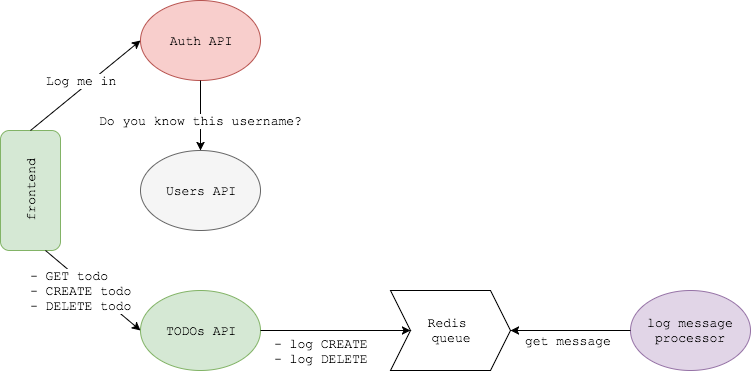

# Deploy applicazione microservizi

Deploy di un'applicazione composto da vari microservizi e servizi di message.

Il servizio è atualmente definito in un docker-compose, e dovrebbe essere deployato as-is su Kubernetes

